# Credit_Risk_Analysis

## Project Overview
The purpose of this project is to use different supervised machine learning models on a credit card dataset from LendingClub to predict credit risk. The machine models used for this project are the Random Over Sampler, Random Under Sampler, SMOTE, SMOTEENN, Random Forest, and ADA Boost.

## Project Results

### RandomOverSampler
- The accuracy score for the Random Over Sampler model was 64%.

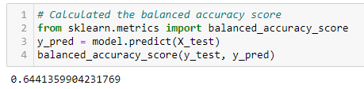

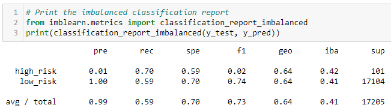

### SMOTE
- The accuracy score for the SMOTE model was 66%.

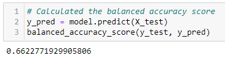

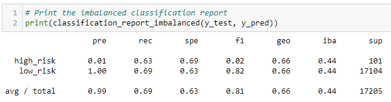

### RandomUnderSampler
- The accuracy score for the Random Under Sampler model was 60%.

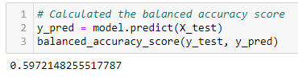

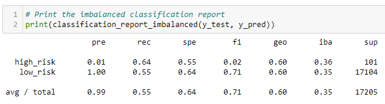

### SMOTEENN
- The accuracy score for the SMOTEENN model was 65%.

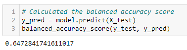

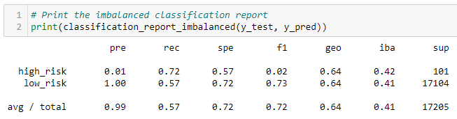

### RandomForestClassifier
- The accuracy score for the Random Forest model was 68%.

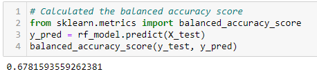

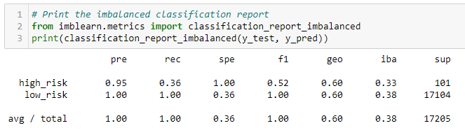

### AdaBoostClassifier
- The accuracy score for the ADA Boost model was 69%.

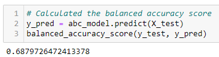

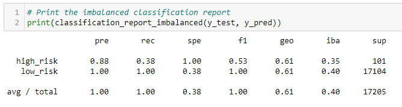

## Project Summary
- All six machine learning models returned an accuracy range between approximately 60 and 69%. While the improvements were modest and incremental between the different models, the ADA Boost model had the highest accuracy and therefore the most recommended for this dataset. 
